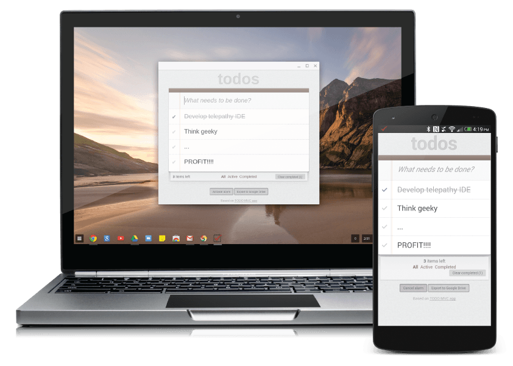
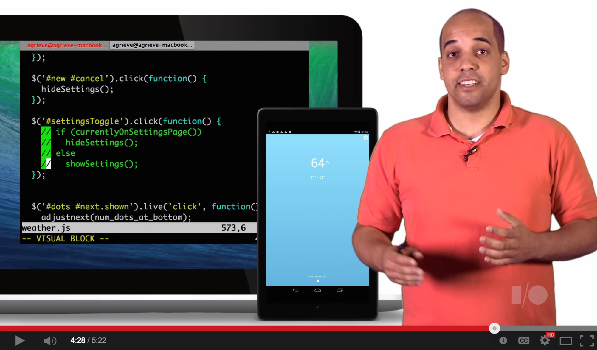

# Run Chrome Apps on Mobile Using Apache Cordova
_**The toolchain for running Chrome Apps on mobile is in early developer preview. Feel free to give us your feedback using the [Github issue tracker](https://github.com/MobileChromeApps/mobile-chrome-apps/issues), our [Chrome Apps developer forum](http://groups.google.com/a/chromium.org/group/chromium-apps/topics), on [Stack Overflow](http://stackoverflow.com/questions/tagged/google-chrome-app), or our [G+ Developers page](https://plus.google.com/+GoogleChromeDevelopers/).**_

## Overview

For an overview of hybrid development, Chrome Apps on mobile, and our Chrome App Developer Tool, check out our Google I/O DevByte.

You can run your [Chrome Apps](http://developer.chrome.com/apps) on Android and iOS via the [`cca` command-line tool](https://github.com/MobileChromeApps/mobile-chrome-apps).  This tool wraps your application's web code with a native Android/iOS application shell, creating a hybrid app, and allowing you to distribute via Google Play and the Apple App Store.  You can learn more from our [FAQ](https://github.com/MobileChromeApps/mobile-chrome-apps/blob/master/docs/faq.md).

The Chrome Apps for Mobile project is build on top of [Apache Cordova](http://cordova.apache.org), the open source mobile development framework for building mobile apps with native capabilities using HTML, CSS and JavaScript.

Try out the `cca` toolchain by following these steps:

* [Step 1: Install your development tools](https://github.com/MobileChromeApps/mobile-chrome-apps/blob/master/docs/Installation.md)

* [Step 2: Create a project](https://github.com/MobileChromeApps/mobile-chrome-apps/blob/master/docs/CreateProject.md)

* [Step 3: Develop](https://github.com/MobileChromeApps/mobile-chrome-apps/blob/master/docs/Develop.md)

* [Step 4: Next Steps](https://github.com/MobileChromeApps/mobile-chrome-apps/blob/master/docs/NextSteps.md)

* [Step 5: Publish](https://github.com/MobileChromeApps/mobile-chrome-apps/blob/master/docs/Publish.md)

## Chrome App Developer Tool (New!)

The [Chrome App Developer Tool](https://github.com/MobileChromeApps/chrome-app-developer-tool/) enables a fast edit/refresh cycle when developing your mobile Chrome App.  It can also be used alongside the [Chrome Dev Editor](https://chrome.google.com/webstore/detail/chrome-dev-editor-develop/pnoffddplpippgcfjdhbmhkofpnaalpg?hl=en) IDE to support rapid, SDK-less development!

## Additional resources

* There are a few special considerations that you should keep in mind when developing with Cordova; we've listed them in the [considerations section](https://github.com/MobileChromeApps/mobile-chrome-apps/blob/master/docs/CordovaConsiderations.md).

* To view which Chrome APIs are supported on mobile, visit the [API Status](https://github.com/MobileChromeApps/mobile-chrome-apps/blob/master/docs/APIStatus.md) page.

## Let's get started

_**Continue to [Step 1: Install your development tools &raquo;](https://github.com/MobileChromeApps/mobile-chrome-apps/blob/master/docs/Installation.md)**_
